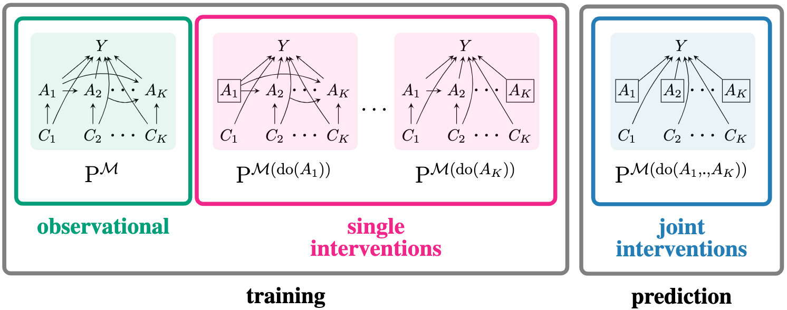

# Learning Joint Interventional Effects from Single-Variable Interventions in Additive Models

[](https://opensource.org/licenses/MIT)
[](https://pytorch.org/)
[](https://lightning.ai/)
[](https://github.com/psf/black)



This repository contains the code for the paper "Learning Joint Interventional Effects from Single-Variable Interventions in Additive Models" published at ICML 2025.

## Installation

Clone the repository and install the package:

```bash
git clone https://github.com/akekic/intervention-generalization.git
cd intervention-generalization
pip install -e .
```

### Requirements

- Python ≥ 3.11
- numpy
- scikit-learn
- matplotlib
- seaborn
- jupyter

## Quick Start

### Basic Experiment

Run a basic experiment with default parameters:

```bash
python -m intervention_generalization --N 10000 --K 5 --N_runs 100
```

This will:
- Generate 100 random polynomial SCMs with 5 action variables
- Train models on 10,000 samples each
- Compare our method against baselines
- Save results and plots to a timestamped directory

### Key Parameters

- `--N`: Number of samples per intervention setting
- `--K`: Number of action variables
- `--N_runs`: Number of experimental runs for statistical significance
- `--scm_type`: Choose between "polynomial" (default) or "linear" SCMs
- `--regularization`: "ridge" (default) or "lasso" regularization

## Repository Structure

```
intervention_generalization/
├── data_generator/          # Synthetic data generation
│   ├── scm.py              # Abstract SCM base class
│   ├── polynomial.py       # Polynomial SCM implementation
│   ├── linear.py           # Linear SCM implementation
│   └── distribution_utils.py # Probability distribution utilities
├── model/                   # Model implementations
│   └── polynomial.py       # Polynomial regression with regularization
├── utils/                   # Utility functions
│   ├── experiment.py       # Main experiment runner
│   ├── utils.py           # Statistics and plotting utilities
│   └── plotting.py        # Data visualization functions
├── __main__.py             # Main experiment script
├── data_ratio_experiment.py # Varying data ratio experiments
└── convergence_experiment.py # Sample efficiency experiments
```

## Experiments

The repository includes three main experimental scripts:

### 1. Main Experiment (`__main__.py`)

Compares our intervention generalization method against baselines:

```bash
python -m intervention_generalization --N 50000 --K 3 --N_runs 50
```

**Baselines**:
- Observational-only model
- Pooled observational + single-intervention data
- Oracle model trained on joint interventional data

### 2. Data Ratio Experiment (`data_ratio_experiment.py`)

Studies the optimal ratio of single-interventional to observational data:

```bash
data_ratio_exp --N_avg 10000 --K 5 --ratios "0.1,0.5,1.0,2.0,5.0"
```

### 3. Convergence Experiment (`convergence_experiment.py`)

Analyzes sample efficiency compared to joint interventional training:

```bash
convergence_exp --N_total "1000,10000,100000,1000000" --K 4
```

## Understanding the Method

### Problem Setup

Consider:
- **Action variables**: A₁, ..., Aₖ (treatments/interventions)
- **Outcome variable**: Y
- **Unobserved confounders**: C₁, ..., Cₖ

**Goal**: Estimate E[Y | do(a₁, ..., aₖ)] using only:
- Observational data: (A, Y) ~ P(A, Y)
- Single interventions: (A, Y) ~ P^(do(Aⱼ))(A, Y) for j = 1, ..., K

### Key Assumption: Additive Outcome Mechanism

```
Y := Σₖ fₖ(Aₖ, Cₖ) + U
```

Where fₖ are arbitrary nonlinear functions and U is exogenous noise.

### Our Estimator

We learn K estimator functions f̂ₖ(a₁, ..., aₖ, Rₖ) where Rₖ ∈ {0,1} indicates intervention status:

```python
# Observational regime: all Rₖ = 0
f̂(a, R=[0,0,0,0,0]) = E[Y | a₁, ..., a₅]

# Single intervention: Rⱼ = 1, others = 0  
f̂(a, R=[0,1,0,0,0]) = E[Y | a₁, do(a₂), a₃, a₄, a₅]

# Joint intervention: all Rₖ = 1
f̂(a, R=[1,1,1,1,1]) = E[Y | do(a₁, ..., a₅)]  # Our target!
```

## Code Example

Generate synthetic data and run intervention generalization:

```python
from intervention_generalization import sample_polynomial_scm, run_experiment

# Create a synthetic SCM
scm = sample_polynomial_scm(K=3)

# Run experiment
results = run_experiment(
    scm=scm,
    K=3,
    N=10000,
    n_order_fit=3,
    regularization='ridge'
)

print(f"Our method RMSE: {results['rmse_method']:.4f}")
print(f"Oracle RMSE: {results['rmse_jint']:.4f}")
print(f"Observational RMSE: {results['rmse_obs']:.4f}")
```

## Citation

If you use this code in your research, please cite:

```bibtex
@inproceedings{kekic2025intervention,
  title={Learning Joint Interventional Effects from Single-Variable Interventions in Additive Models},
  author={Keki{\'c}, Armin and Garrido Mejia, Sergio Hernan and Sch{\"o}lkopf, Bernhard},
  booktitle={Proceedings of the 42nd International Conference on Machine Learning},
  year={2025},
  organization={PMLR}
}
```

## License

This project is licensed under the [MIT license](https://opensource.org/licenses/MIT).
See the [LICENSE](LICENSE) file for details.